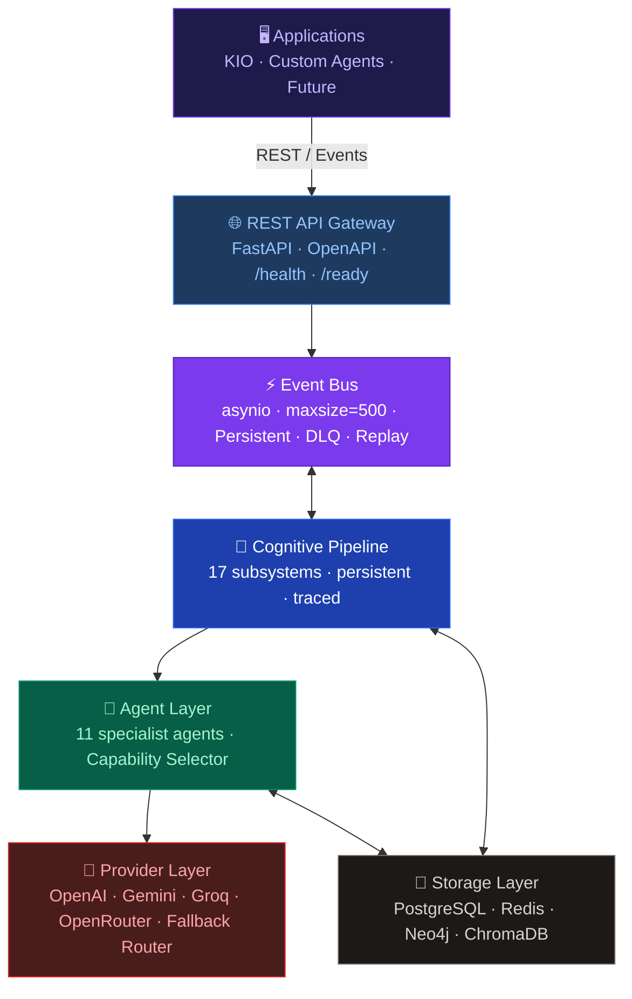
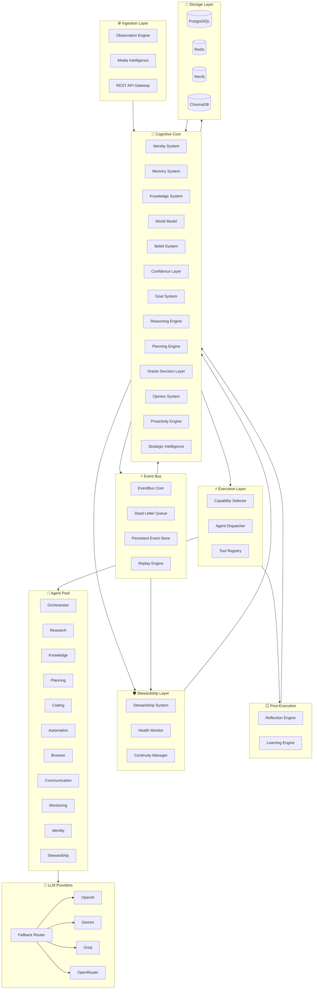
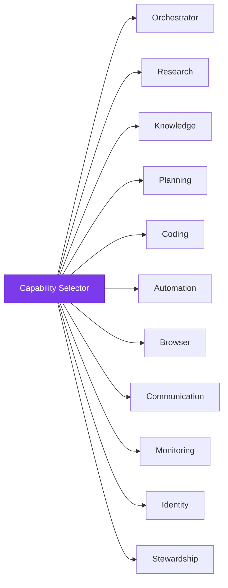
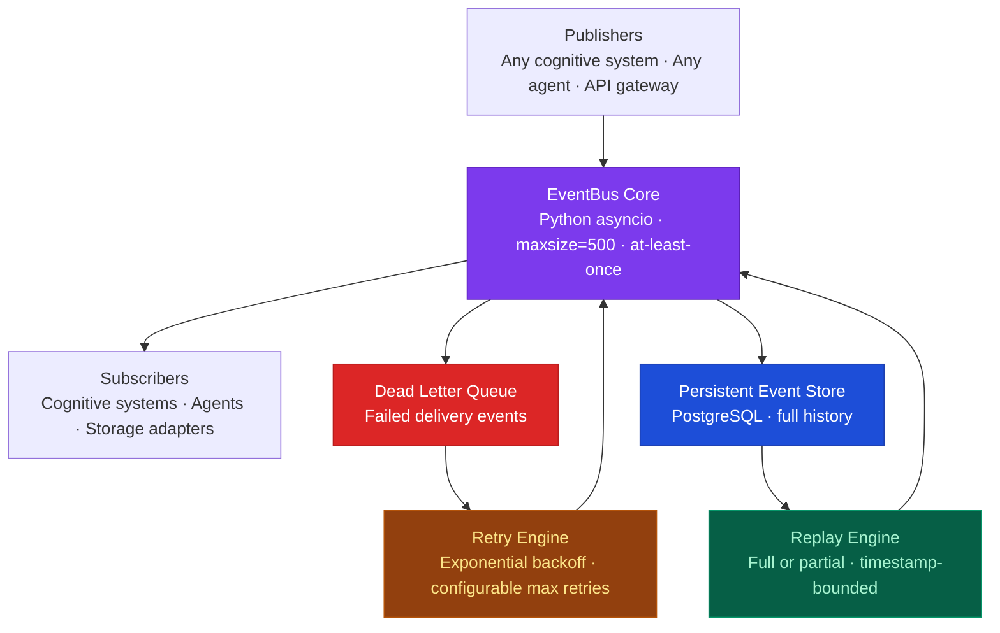
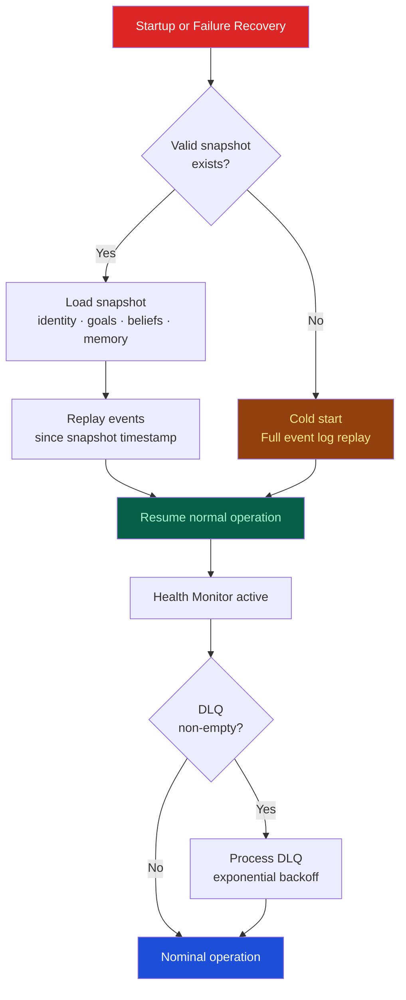
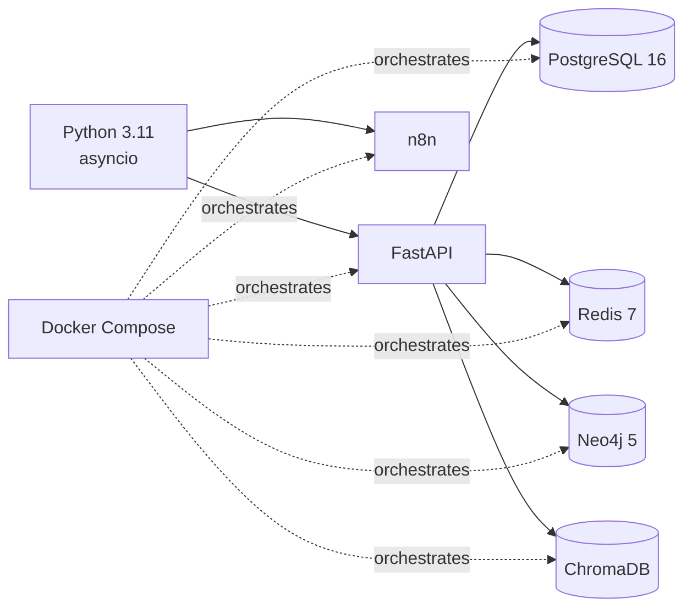

cat > /home/claude/README_v2.md << 'ENDOFREADME'
<div align="center">

<!-- HERO BANNER -->
<picture>
  <source media="(prefers-color-scheme: dark)" srcset="https://capsule-render.vercel.app/api?type=waving&color=0:0f0c29,50:302b63,100:24243e&height=240&section=header&text=AURA&fontSize=100&fontColor=ffffff&fontAlignY=40&desc=Autonomous%20Unified%20Reasoning%20Architecture&descAlignY=64&descSize=24&descColor=a78bfa&animation=fadeIn"/>
  
</picture>

<br/>
<br/>

<!-- BADGES ROW 1 -->
[](./LICENSE)
[](https://python.org)
[](https://fastapi.tiangolo.com)
[](https://docker.com)

<!-- BADGES ROW 2 -->
[](https://postgresql.org)
[](https://redis.io)
[](https://neo4j.com)
[]()

<br/>
<br/>

<!-- NAVIGATION -->
<p>
  <a href="#-what-is-aura">What is AURA</a>&nbsp;&nbsp;·&nbsp;&nbsp;
  <a href="#-design-philosophy">Design Philosophy</a>&nbsp;&nbsp;·&nbsp;&nbsp;
  <a href="#-cognitive-pipeline">Pipeline</a>&nbsp;&nbsp;·&nbsp;&nbsp;
  <a href="#-architecture">Architecture</a>&nbsp;&nbsp;·&nbsp;&nbsp;
  <a href="#-cognitive-systems">Systems</a>&nbsp;&nbsp;·&nbsp;&nbsp;
  <a href="#-agent-layer">Agents</a>&nbsp;&nbsp;·&nbsp;&nbsp;
  <a href="#-event-system">Events</a>&nbsp;&nbsp;·&nbsp;&nbsp;
  <a href="#-recovery-architecture">Recovery</a>&nbsp;&nbsp;·&nbsp;&nbsp;
  <a href="#-media-intelligence">Media</a>&nbsp;&nbsp;·&nbsp;&nbsp;
  <a href="#-integrations">Integrations</a>&nbsp;&nbsp;·&nbsp;&nbsp;
  <a href="#-getting-started">Get Started</a>&nbsp;&nbsp;·&nbsp;&nbsp;
  <a href="#-api-reference">API</a>&nbsp;&nbsp;·&nbsp;&nbsp;
  <a href="#-performance">Performance</a>&nbsp;&nbsp;·&nbsp;&nbsp;
  <a href="#-security">Security</a>&nbsp;&nbsp;·&nbsp;&nbsp;
  <a href="#-project-status">Status</a>
</p>

<br/>

<!-- FEATURE CARDS -->
<table>
<tr>
<td align="center" width="190">
<strong>🧠 Cognitive Backend</strong><br/>
<sub>Not a chatbot.<br/>A persistent reasoning engine.</sub>
</td>
<td align="center" width="190">
<strong>⚡ Event-Driven</strong><br/>
<sub>Every cognitive transition<br/>is observable and replayable.</sub>
</td>
<td align="center" width="190">
<strong>🔌 Provider Agnostic</strong><br/>
<sub>OpenAI · Gemini · Groq · OpenRouter<br/>Swap without rewrites.</sub>
</td>
<td align="center" width="190">
<strong>♾️ Persistent Cognition</strong><br/>
<sub>PostgreSQL · ChromaDB · Neo4j<br/>Memory survives restarts.</sub>
</td>
</tr>
</table>

</div>

---

## 🧠 What is AURA?

AURA is not a chatbot, assistant wrapper, or agent framework in the prompt-chaining sense.

AURA is an **event-driven cognitive architecture** — a backend runtime that provides a complete set of cognitive subsystems to any agent application built on top of it. These subsystems include: observation, identity, memory, knowledge, world modelling, belief formation, confidence tracking, goal management, reasoning, planning, decision gating, opinion formation, reflection, learning, strategic intelligence, proactivity, continuity, and stewardship.

Every subsystem is independently addressable, persisted across sessions, and connected through a shared event bus. AURA assumes failure and provides recovery mechanisms at every layer.

> AURA occupies the infrastructure layer. It has no personality, no interface, and no hardcoded use-case. Applications are built on top of it.

**KIO** — a personal AI companion — is one application built on AURA. KIO is not AURA, and AURA is not a KIO feature.

<br/>

<div align="center">

```
┌──────────────────────────────────────────────────────────────────────┐
│                                                                      │
│   AURA  ≠  Chatbot                                                   │
│   AURA  ≠  LLM Wrapper                                               │
│   AURA  ≠  Agent Framework in the prompt-chain sense                 │
│   AURA  ≠  Single-session reasoning                                  │
│                                                                      │
│   AURA  =  Cognitive operating system for persistent agents          │
│                                                                      │
└──────────────────────────────────────────────────────────────────────┘
```

</div>

### Cognitive capabilities provided

| Capability | Description | Status |
|---|---|---|
| **Observation** | Structured ingestion of signals — text, media, events | ✅ Implemented |
| **Identity** | Persistent agent identity across sessions and restarts | ✅ Implemented |
| **Memory** | Episodic, semantic, and working memory with vector + graph retrieval | ✅ Implemented |
| **Knowledge** | Structured knowledge base with confidence scoring | ✅ Implemented |
| **World Model** | Entity graph representing the agent's environment | ✅ Implemented |
| **Beliefs** | Probabilistic belief system with evidence tracking | ✅ Implemented |
| **Confidence** | Per-claim confidence layer across all cognitive outputs | ✅ Implemented |
| **Goals** | Hierarchical goal management with priority and temporal decay | ✅ Implemented |
| **Reasoning** | Structured multi-step reasoning with trace recording | ✅ Implemented |
| **Oracle Decision Layer** | Confidence-gated decision control for high-stakes actions | ✅ Implemented |
| **Opinions** | Agent-formed assessments with explicit justification chains | ✅ Implemented |
| **Reflection** | Post-execution audit of action and reasoning quality | ✅ Implemented |
| **Learning** | Feedback-driven belief and confidence update loop | ✅ Implemented |
| **Continuity** | Cross-session cognitive state persistence and restoration | ✅ Implemented |
| **Stewardship** | Long-term system health monitoring and autonomous maintenance | ✅ Implemented |
| **Strategic Intelligence** | Multi-horizon goal-coherent planning | ✅ Implemented |
| **Proactivity** | Autonomous goal-triggered action without external prompt | ✅ Implemented |

---

## 🎯 Design Philosophy

These are the architectural decisions AURA was built around and the reasoning behind each.

### Why event-driven?

Cognitive state changes are not function calls. Memory retrieval, belief update, and goal re-evaluation happen asynchronously, in response to stimuli, and at different timescales. An event-driven runtime makes every cognitive transition explicit, observable, replayable, and recoverable. It also decouples subsystems — the Reasoning Engine does not need to know how Memory stores data; it publishes an event and subscribes to results.

### Why cognitive architecture rather than prompt chaining?

Prompt chains are stateless by default and session-scoped by necessity. AURA treats cognition as a set of persistent subsystems — analogous to how an operating system manages processes, memory, and I/O — rather than a sequence of API calls. Goals persist across sessions. Beliefs accumulate evidence over time. Reflection modifies future reasoning. None of this is achievable with prompt orchestration alone.

### Why persistence?

A reasoning system that resets at session end is not a cognitive system — it is a calculator. AURA persists every observation, belief, memory, and event to durable storage. The agent that runs today has access to everything it learned last week. Cognitive continuity is not an optional feature; it is the core design requirement.

### Why modular cognition?

Each cognitive subsystem in AURA has a single responsibility, a defined interface, and its own storage strategy. This means subsystems can be tested in isolation, replaced without rewrites, and extended without modifying unrelated code. Adding a new reasoning mode does not require touching the memory system.

### Why provider agnostic?

LLM providers change pricing, degrade in quality, and impose rate limits unpredictably. AURA abstracts provider calls behind a common interface with a fallback router. The cognitive architecture does not depend on any specific provider's capabilities. Swapping OpenAI for Groq requires changing environment variables, not rewriting subsystems.

### Why tool agnostic?

Tools are selected at runtime by the Capability Selector based on task requirements. AURA does not hardcode tool usage into cognitive logic. An agent using AURA today can use a different tool tomorrow without modifying its goals, beliefs, or reasoning traces.

---

## 🔄 Cognitive Pipeline

Every signal entering AURA traverses this pipeline in order. Each stage is a discrete subsystem with its own persistence.

```mermaid
flowchart TD
    A([🌐 Observation\nNormalise raw input]) --> B([🪪 Identity\nBind to agent context])
    B --> C([🧠 Memory\nRetrieve relevant history])
    C --> D([📚 Knowledge\nEnrich with structured facts])
    D --> E([🗺️ World Model\nUpdate entity graph])
    E --> F([💭 Beliefs\nUpdate probabilistic stances])
    F --> G([🎯 Goals\nEvaluate goal relevance])
    G --> H([⚙️ Reasoning\nGenerate traced reasoning chain])
    H --> I([📋 Planning\nDecompose into action steps])
    I --> J([🔧 Capability Selection\nRoute to appropriate agent or tool])
    J --> K([⚡ Execution\nRun action and capture result])
    K --> L([🪞 Reflection\nAudit action quality])
    L --> M([📈 Learning\nUpdate beliefs and confidence])
    M --> N([🛡️ Stewardship\nCheck system health])
    N --> O([♾️ Continuity\nPersist cognitive state])

    style A fill:#7c3aed,color:#fff,stroke:#5b21b6
    style B fill:#6d28d9,color:#fff,stroke:#5b21b6
    style C fill:#5b21b6,color:#fff,stroke:#4c1d95
    style D fill:#4c1d95,color:#fff,stroke:#3730a3
    style E fill:#3730a3,color:#fff,stroke:#312e81
    style F fill:#1e40af,color:#fff,stroke:#1e3a8a
    style G fill:#1d4ed8,color:#fff,stroke:#1e40af
    style H fill:#2563eb,color:#fff,stroke:#1d4ed8
    style I fill:#3b82f6,color:#fff,stroke:#2563eb
    style J fill:#0ea5e9,color:#fff,stroke:#0284c7
    style K fill:#06b6d4,color:#fff,stroke:#0891b2
    style L fill:#0d9488,color:#fff,stroke:#0f766e
    style M fill:#059669,color:#fff,stroke:#047857
    style N fill:#16a34a,color:#fff,stroke:#15803d
    style O fill:#22c55e,color:#fff,stroke:#16a34a
```

<details>
<summary><strong>📊 Mermaid Diagram</strong></summary>



</details>

<details>
<summary><strong>🖥️ ASCII Pipeline with Stage Descriptions</strong></summary>

```
╔══════════════════════════════════════════════════════════════════════════════╗
║                          AURA COGNITIVE PIPELINE                            ║
╠══════════════════════════════════════════════════════════════════════════════╣
║                                                                              ║
║  ┌────────────────────────────────┐                                          ║
║  │         OBSERVATION            │  Normalise raw input into a structured   ║
║  │  text · media · events         │  cognitive event with provenance tags.   ║
║  └───────────────┬────────────────┘                                          ║
║                  ▼                                                           ║
║  ┌────────────────────────────────┐                                          ║
║  │          IDENTITY              │  Bind the observation to a specific      ║
║  │  fingerprint · session         │  agent identity and active session.      ║
║  └───────────────┬────────────────┘                                          ║
║                  ▼                                                           ║
║  ┌────────────────────────────────┐                                          ║
║  │           MEMORY               │  Retrieve episodic, semantic, and        ║
║  │  episodic · semantic · working │  working memory relevant to the input.   ║
║  └───────────────┬────────────────┘                                          ║
║                  ▼                                                           ║
║  ┌────────────────────────────────┐                                          ║
║  │          KNOWLEDGE             │  Enrich with structured facts and        ║
║  │  facts · concepts · confidence │  confidence-scored domain knowledge.     ║
║  └───────────────┬────────────────┘                                          ║
║                  ▼                                                           ║
║  ┌────────────────────────────────┐                                          ║
║  │         WORLD MODEL            │  Update the entity graph with new        ║
║  │  entities · relations · state  │  relationships derived from the input.   ║
║  └───────────────┬────────────────┘                                          ║
║                  ▼                                                           ║
║  ┌────────────────────────────────┐                                          ║
║  │           BELIEFS              │  Update probabilistic stances using      ║
║  │  priors · evidence · update    │  incoming evidence via Bayesian update.  ║
║  └───────────────┬────────────────┘                                          ║
║                  ▼                                                           ║
║  ┌────────────────────────────────┐                                          ║
║  │            GOALS               │  Evaluate whether the input is relevant  ║
║  │  objectives · priority · decay │  to active goals and adjust priorities.  ║
║  └───────────────┬────────────────┘                                          ║
║                  ▼                                                           ║
║  ┌────────────────────────────────┐                                          ║
║  │          REASONING             │  Produce a structured, traced reasoning  ║
║  │  deductive · traced · scored   │  chain over the available context.       ║
║  └───────────────┬────────────────┘                                          ║
║                  ▼                                                           ║
║  ┌────────────────────────────────┐                                          ║
║  │           PLANNING             │  Decompose the reasoning output into     ║
║  │  steps · horizon · cost        │  an ordered, costed action sequence.     ║
║  └───────────────┬────────────────┘                                          ║
║                  ▼                                                           ║
║  ┌────────────────────────────────┐                                          ║
║  │     CAPABILITY SELECTION       │  Route the action to the appropriate     ║
║  │  agent · tool · provider       │  agent, tool, or provider.               ║
║  └───────────────┬────────────────┘                                          ║
║                  ▼                                                           ║
║  ┌────────────────────────────────┐                                          ║
║  │          EXECUTION             │  Run the selected action and capture     ║
║  │  run · observe · record        │  the result as a new observation.        ║
║  └───────────────┬────────────────┘                                          ║
║                  ▼                                                           ║
║  ┌────────────────────────────────┐                                          ║
║  │          REFLECTION            │  Compare expected vs. actual outcome.    ║
║  │  critique · score · flag       │  Score reasoning quality. Flag errors.   ║
║  └───────────────┬────────────────┘                                          ║
║                  ▼                                                           ║
║  ┌────────────────────────────────┐                                          ║
║  │           LEARNING             │  Update belief probabilities and         ║
║  │  update · calibrate · persist  │  confidence calibration from reflection. ║
║  └───────────────┬────────────────┘                                          ║
║                  ▼                                                           ║
║  ┌────────────────────────────────┐                                          ║
║  │         STEWARDSHIP            │  Check system health. Trigger repair     ║
║  │  health · resources · repair   │  or alerting if thresholds are breached. ║
║  └───────────────┬────────────────┘                                          ║
║                  ▼                                                           ║
║  ┌────────────────────────────────┐                                          ║
║  │          CONTINUITY            │  Persist cognitive state to durable      ║
║  │  snapshot · restore · persist  │  storage. Bind snapshot to event log.    ║
║  └────────────────────────────────┘                                          ║
║                                                                              ║
╚══════════════════════════════════════════════════════════════════════════════╝
```

</details>

---

## 🏗️ Architecture

<details>
<summary><strong>📐 High-Level Runtime Stack</strong></summary>



</details>

<details>
<summary><strong>📐 Full Subsystem Architecture (Mermaid)</strong></summary>



</details>

<details>
<summary><strong>🖥️ ASCII Architecture Overview</strong></summary>

```
┌──────────────────────────────────────────────────────────────────────────────┐
│                            AURA SYSTEM OVERVIEW                              │
├──────────────────────────────────────────────────────────────────────────────┤
│                                                                              │
│  ┌───────────────────────────────────────────────────────────────────────┐   │
│  │                           APPLICATIONS                               │   │
│  │            KIO  ·  [your application]  ·  [future agents]            │   │
│  └──────────────────────────────┬────────────────────────────────────────┘   │
│                                 │  REST / Events                             │
│  ┌──────────────────────────────▼────────────────────────────────────────┐   │
│  │                          API GATEWAY                                  │   │
│  │               FastAPI  ·  OpenAPI  ·  /health  ·  /ready              │   │
│  └───────────┬───────────────────────────────────────┬────────────────────┘  │
│              │                                       │                       │
│  ┌───────────▼─────────────────┐         ┌──────────▼──────────────────┐    │
│  │       COGNITIVE CORE        │         │         EVENT BUS            │    │
│  │                             │◄───────►│                             │    │
│  │  Identity     Memory        │         │  Publish / Subscribe        │    │
│  │  Knowledge    World Model   │         │  Dead Letter Queue          │    │
│  │  Beliefs      Confidence    │         │  Persistent Event Store     │    │
│  │  Goals        Reasoning     │         │  Replay Engine              │    │
│  │  Planning     Oracle        │         │  Recovery on restart        │    │
│  │  Opinions     Proactivity   │         │                             │    │
│  │  Strategy     Reflection    │         └─────────────────────────────┘    │
│  │  Learning     Continuity    │                                             │
│  │  Stewardship                │                                             │
│  └───────────┬─────────────────┘                                             │
│              │                                                               │
│  ┌───────────▼─────────────────┐         ┌─────────────────────────────┐    │
│  │         AGENT LAYER         │         │       LLM PROVIDERS         │    │
│  │                             │◄───────►│                             │    │
│  │  Orchestrator   Research    │         │  OpenAI      Gemini         │    │
│  │  Knowledge      Planning    │         │  Groq        OpenRouter     │    │
│  │  Coding         Automation  │         │                             │    │
│  │  Browser        Comms       │         │  Fallback router: active    │    │
│  │  Monitoring     Identity    │         │  Requires: API key config   │    │
│  │  Stewardship                │         │                             │    │
│  └───────────┬─────────────────┘         └─────────────────────────────┘    │
│              │                                                               │
│  ┌───────────▼──────────────────────────────────────────────────────────┐   │
│  │                          STORAGE LAYER                               │   │
│  │                                                                      │   │
│  │   PostgreSQL          Redis           Neo4j           ChromaDB       │   │
│  │   Episodes · events   Working memory  World Model     Semantic       │   │
│  │   Snapshots · beliefs Cache · session Entity graph    memory search  │   │
│  └──────────────────────────────────────────────────────────────────────┘   │
│                                                                              │
└──────────────────────────────────────────────────────────────────────────────┘
```

</details>

<details>
<summary><strong>🔗 KIO ↔ AURA Relationship</strong></summary>



```mermaid
graph LR
    subgraph AURA_CORE ["AURA (Cognitive Backend — Infrastructure Layer)"]
        COG2[Cognitive Pipeline]
        MEM2[Memory]
        GOAL2[Goals]
        RSN2[Reasoning]
        AGENTS2[Agent Pool]
        EB2[Event Bus]
        STOR[Storage Layer]
    end

    subgraph KIO ["KIO (Application Layer — one tenant)"]
        TELE[Telegram Interface]
        CHAR[Character Layer]
        RESP[Response Generator]
        SESS[Session Manager]
    end

    subgraph OTHER_APPS ["Other Applications (Independent)"]
        APP2[Custom Agent A]
        APP3[Custom Agent B]
    end

    KIO -->|"REST · Events"| AURA_CORE
    OTHER_APPS -->|"REST · Events"| AURA_CORE
    AURA_CORE -->|"Cognitive state · Memory · Decisions"| KIO
    AURA_CORE -->|"Cognitive state · Memory · Decisions"| OTHER_APPS

    style AURA_CORE fill:#1e1b4b,stroke:#7c3aed,color:#c4b5fd
    style KIO fill:#0f172a,stroke:#3b82f6,color:#93c5fd
    style OTHER_APPS fill:#0f172a,stroke:#64748b,color:#94a3b8
```

> AURA has no awareness of KIO's personality, interface, or character. KIO consumes AURA's cognitive output. Multiple applications can run concurrently as independent tenants on the same AURA instance.

</details>

---

## 🧩 Cognitive Systems

Each system is a discrete, independently addressable subsystem within the AURA cognitive core.

<details open>
<summary><strong>🔍 Observation Layer &nbsp;·&nbsp; <code>IMPLEMENTED</code></strong></summary>

**Responsibility**: Normalise all incoming signals into structured cognitive events before they enter the pipeline.

**Accepts**: Text strings, media-derived text, document content, transcripts, structured events.

**Outputs**: A normalised `ObservationEvent` with provenance metadata, source classification, and timestamp — published to the Event Bus.

**Note**: AURA's Observation Layer processes signal type classification and schema normalisation. It does not perform raw computer vision or audio transcription. Media must be reduced to text upstream before ingestion. See [Media Intelligence](#-media-intelligence).

</details>

<details>
<summary><strong>🪪 Identity System &nbsp;·&nbsp; <code>IMPLEMENTED</code></strong></summary>

**Responsibility**: Maintain a stable, persistent identity record for each agent instance.

**Inputs**: Session initiation event, agent configuration.

**Outputs**: Identity fingerprint bound to the active session. All subsequent pipeline events are tagged with this identity.

**Persistence**: PostgreSQL. Identity records survive process restarts and container recycling.

**Interactions**: Provides session binding to Memory, Continuity, and all agent dispatches.

</details>

<details>
<summary><strong>🧠 Memory System &nbsp;·&nbsp; <code>IMPLEMENTED</code></strong></summary>

**Responsibility**: Store and retrieve relevant past observations, interactions, and state.

**Architecture**:

| Memory Type | Backend | Purpose |
|---|---|---|
| Episodic | PostgreSQL + ChromaDB | What happened, when, and in what context |
| Semantic | ChromaDB + Neo4j | General concepts, facts, and named entity relationships |
| Working | Redis | Active session context — fast access, session-scoped |

**Inputs**: Observation events, Knowledge enrichment, World Model state.

**Outputs**: Ranked memory retrieval results with relevance scores. Memory write events persisted to all three backends.

**Interactions**: Feeds retrieved memories to Knowledge, Beliefs, and Reasoning. Working memory is flushed to PostgreSQL at session end and rebuilt from it on restart.

</details>

<details>
<summary><strong>📚 Knowledge System &nbsp;·&nbsp; <code>IMPLEMENTED</code></strong></summary>

**Responsibility**: Maintain a structured repository of verified facts, domain knowledge, and named concepts with confidence scoring.

**Inputs**: Observation events, external knowledge injection via API, Learning Engine updates.

**Outputs**: Enriched context passed to World Model and Reasoning. Knowledge write events persisted to storage.

**Properties**: Each knowledge item carries a confidence score, evidence reference list, creation timestamp, and optional version history. Knowledge can be retracted or superseded.

**Interactions**: Knowledge Agent manages CRUD. Belief System reads knowledge confidence when forming probabilistic stances.

</details>

<details>
<summary><strong>🗺️ World Model &nbsp;·&nbsp; <code>IMPLEMENTED</code></strong></summary>

**Responsibility**: Maintain the agent's internal graph-based representation of its environment — entities, relationships, and current state.

**Backend**: Neo4j property graph.

**Inputs**: Normalised observations, memory retrieval output, knowledge enrichment.

**Outputs**: Updated entity graph. Relationship inference results passed to Belief System.

**Interactions**: World Model is the input substrate for Belief formation and the primary source of entity resolution during Reasoning. The Knowledge Agent reads from it; the Stewardship Agent monitors its consistency.

</details>

<details>
<summary><strong>💭 Belief System &nbsp;·&nbsp; <code>IMPLEMENTED</code></strong></summary>

**Responsibility**: Maintain a probabilistic set of stances over propositions, updated with new evidence.

**Inputs**: World Model state, Knowledge confidence scores, Observation events.

**Outputs**: Updated belief set with probability estimates and evidence lists. `BeliefUpdateEvent` published to Event Bus on change.

**Update mechanism**: Evidence from each new observation is evaluated against existing beliefs. Confirming evidence raises probability; contradicting evidence lowers it. The update strategy is configurable.

**Interactions**: Belief state is a primary input to Reasoning and Oracle. Opinions are derived from beliefs.

</details>

<details>
<summary><strong>📊 Confidence System &nbsp;·&nbsp; <code>IMPLEMENTED</code></strong></summary>

**Responsibility**: Attach a calibrated confidence score to every output produced by the cognitive pipeline.

**Inputs**: Reasoning traces, belief probabilities, knowledge confidence scores.

**Outputs**: Confidence-annotated cognitive outputs. Scores consumed by Oracle Decision Layer.

**Interactions**: The Oracle Decision Layer uses confidence scores to gate high-stakes actions. The Learning Engine uses them for calibration feedback. Low-confidence outputs are flagged in Reflection.

</details>

<details>
<summary><strong>🎯 Goal System &nbsp;·&nbsp; <code>IMPLEMENTED</code></strong></summary>

**Responsibility**: Manage the agent's active objective set with priority ordering, subgoal decomposition, and temporal decay.

**Inputs**: External goal injection via API, autonomous goal creation from Proactivity Engine, goal completion signals from Reflection.

**Outputs**: Prioritised active goal list. `GoalEvent` published on creation, update, or completion.

**Properties**: Goals have a priority score (0–100), an optional deadline, and a decay function. Subgoals are linked to parent goals. Completed goals are archived, not deleted — they become episodic memories.

**Interactions**: Active goal set is the primary input to Planning and Strategic Intelligence. Proactivity Engine monitors goal state to trigger autonomous action.

</details>

<details>
<summary><strong>⚙️ Reasoning Engine &nbsp;·&nbsp; <code>IMPLEMENTED</code></strong></summary>

**Responsibility**: Produce structured, multi-step reasoning over the available cognitive context, with full trace recording.

**Inputs**: Memory retrieval, enriched knowledge context, current belief set, active goals.

**Outputs**: A reasoning trace (chain-of-thought) with intermediate steps, confidence scores per step, and a final conclusion. Trace persisted to PostgreSQL.

**Interactions**: Reasoning trace is the primary input to Planning. Reflection Engine audits reasoning traces post-execution. Stored traces are available for inspection and replay.

</details>

<details>
<summary><strong>🔮 Oracle Decision Layer &nbsp;·&nbsp; <code>IMPLEMENTED</code></strong></summary>

**Responsibility**: Gate high-stakes or irreversible actions behind a configurable confidence threshold.

**Inputs**: Proposed action from Planning, confidence score from Confidence System.

**Behaviour**:
- If confidence ≥ `REPLAN_CONFIDENCE_FLOOR` (default `0.6`): action proceeds autonomously.
- If confidence < threshold: action is queued for deferred review or escalated.

**Outputs**: Approval or deferral decision. Audit record persisted for every Oracle evaluation.

**Interactions**: Oracle sits between Planning and Capability Selection. It does not modify the action — it gates it. Every Oracle decision is auditable.

</details>

<details>
<summary><strong>💬 Opinion System &nbsp;·&nbsp; <code>IMPLEMENTED</code></strong></summary>

**Responsibility**: Form and persist subjective assessments derived from the agent's belief set and goal context.

**Inputs**: Belief probabilities, World Model state, active goals.

**Outputs**: Opinion records with explicit justification chains. Opinions are distinctly labelled — they are not treated as facts.

**Interactions**: Opinions are available to Reasoning as soft context. They are not used as hard constraints. The distinction between Opinion and Knowledge is enforced at the data model level.

</details>

<details>
<summary><strong>🪞 Reflection Engine &nbsp;·&nbsp; <code>IMPLEMENTED</code></strong></summary>

**Responsibility**: Audit agent actions and reasoning quality post-execution by comparing expected outcomes to actual results.

**Inputs**: Execution result, original reasoning trace, expected outcome from Planning.

**Outputs**: Reflection record with a quality score, identified inconsistencies, and flagged failures. `ReflectionEvent` published to Event Bus.

**Interactions**: Reflection output is the primary input to the Learning Engine. Persistent reflection records enable longitudinal quality analysis.

</details>

<details>
<summary><strong>📈 Learning Engine &nbsp;·&nbsp; <code>IMPLEMENTED</code></strong></summary>

**Responsibility**: Apply Reflection output to update beliefs, confidence calibration, and goal evaluation logic.

**Inputs**: `ReflectionEvent` with quality scores and identified failures.

**Outputs**: Updated belief probabilities. Updated confidence calibration parameters. `LearningEvent` published. All updates persisted.

**Scope**: Learning in AURA v1.1 operates at the belief and confidence layer. It does not perform model fine-tuning or weight updates on the underlying LLM. Those are planned future capabilities.

</details>

<details>
<summary><strong>🎯 Strategic Intelligence &nbsp;·&nbsp; <code>IMPLEMENTED</code></strong></summary>

**Responsibility**: Maintain coherent multi-horizon planning across near-term, mid-term, and long-term goal sets.

**Inputs**: Active goal set with priorities, World Model state, belief confidence.

**Outputs**: Ordered horizon-stratified plan. Conflicts between competing goals are resolved by priority weights.

**Interactions**: Strategic Intelligence informs Planning on which goals to prioritise when multiple are active. It does not execute — it provides the priority ordering that Planning consumes.

</details>

<details>
<summary><strong>⚡ Proactivity Engine &nbsp;·&nbsp; <code>IMPLEMENTED</code></strong></summary>

**Responsibility**: Monitor goal state and environmental signals to trigger autonomous action without an external prompt.

**Inputs**: Active goal set, Monitoring Agent signals, temporal triggers.

**Outputs**: Autonomous `GoalEvent` or `ExecutionEvent` injected into the pipeline when trigger conditions are met.

**Inhibition**: A configurable inhibition threshold prevents runaway autonomous action. Actions below the threshold are queued for review rather than executed immediately.

</details>

<details>
<summary><strong>♾️ Continuity Manager &nbsp;·&nbsp; <code>IMPLEMENTED</code></strong></summary>

**Responsibility**: Ensure the agent's cognitive state survives restarts, failures, and long-running operation through periodic snapshots and event log binding.

**Inputs**: Periodic timer, manual snapshot requests via API.

**Outputs**: Snapshot record persisted to PostgreSQL, containing agent identity, active goals, belief set, and working memory digest. Snapshot is timestamped and linked to the event log position.

**Interactions**: On startup, AURA checks for a valid snapshot before beginning event replay. Working memory is rebuilt from PostgreSQL if Redis is cold. See [Recovery Architecture](#-recovery-architecture).

</details>

<details>
<summary><strong>🛡️ Stewardship System &nbsp;·&nbsp; <code>IMPLEMENTED</code></strong></summary>

**Responsibility**: Monitor long-term system health, detect anomalies, and coordinate autonomous maintenance tasks.

**Inputs**: `HealthEvent` stream from Health Monitor, storage metrics, DLQ depth readings.

**Outputs**: Maintenance task dispatches to Stewardship Agent. Health alerts when thresholds are breached.

**Monitors**: Event Bus queue depth, storage connection latency, DLQ accumulation rate, snapshot freshness, belief/knowledge store consistency.

**Interactions**: Integrates with Health Monitor for `/health` endpoint data. Dispatches Stewardship Agent for repair tasks. Does not modify cognitive state directly.

</details>

---

## 🤖 Agent Layer

AURA's agent pool provides specialised execution capability. Agents are dispatched by the Capability Selector based on task classification. The agent framework is operational; individual agents require activation and configuration.



<details>
<summary><strong>🎭 Orchestrator Agent &nbsp;·&nbsp; <code>FRAMEWORK OPERATIONAL · REQUIRES ACTIVATION</code></strong></summary>

**Responsibilities**: Coordinate multi-agent task flows. Own the execution plan. Route subtasks to specialist agents. Manage inter-agent dependency ordering.

**Inputs**: High-level task from Planning Engine. Subtask completion signals from specialist agents.

**Outputs**: Ordered subtask dispatch. Aggregated result returned to Cognitive Core.

**Interactions**: Does not execute domain tasks directly. It calls other agents. It is the only agent that may call other agents.

</details>

<details>
<summary><strong>🔬 Research Agent &nbsp;·&nbsp; <code>FRAMEWORK OPERATIONAL · REQUIRES ACTIVATION</code></strong></summary>

**Responsibilities**: Retrieve and synthesise information from memory, knowledge base, and configured external sources.

**Inputs**: Research query from Orchestrator or direct dispatch. Access to Memory and Knowledge systems.

**Outputs**: Structured research result published back as an `ObservationEvent` for ingestion into the cognitive pipeline.

**Interactions**: Reads from Memory and Knowledge. Does not write directly — findings re-enter via the Observation pipeline.

</details>

<details>
<summary><strong>📚 Knowledge Agent &nbsp;·&nbsp; <code>FRAMEWORK OPERATIONAL · REQUIRES ACTIVATION</code></strong></summary>

**Responsibilities**: Manage knowledge base CRUD operations. Validate incoming knowledge items. Score confidence. Resolve conflicts with existing knowledge.

**Inputs**: Knowledge write/update/delete requests from Orchestrator, Learning Engine updates, external injection via API.

**Outputs**: Confirmed knowledge write events. Conflict reports when new items contradict existing knowledge.

**Interactions**: Direct read/write access to Knowledge System. Publishes `KnowledgeEvent` on mutation.

</details>

<details>
<summary><strong>📋 Planning Agent &nbsp;·&nbsp; <code>FRAMEWORK OPERATIONAL · REQUIRES ACTIVATION</code></strong></summary>

**Responsibilities**: Decompose high-level goals into ordered, costed, actionable step sequences.

**Inputs**: Active goals from Goal System, Strategic Intelligence priority ordering, Reasoning Engine output.

**Outputs**: Action plan consumed by Orchestrator. Plan persisted for Reflection audit.

**Interactions**: Reads from Goal System and Strategic Intelligence. Does not execute. Plans are passed to Orchestrator.

</details>

<details>
<summary><strong>💻 Coding Agent &nbsp;·&nbsp; <code>FRAMEWORK OPERATIONAL · REQUIRES ACTIVATION</code></strong></summary>

**Responsibilities**: Generate, review, and debug code. Execute code in a sandboxed context and capture output.

**Inputs**: Coding task specification from Orchestrator. Optional existing code for review or modification.

**Outputs**: Generated or modified code. Execution result. Flagged errors or test failures.

**Interactions**: Execution environment sandboxing is required before production deployment. Does not have filesystem access by default.

</details>

<details>
<summary><strong>⚙️ Automation Agent &nbsp;·&nbsp; <code>FRAMEWORK OPERATIONAL · REQUIRES ACTIVATION</code></strong></summary>

**Responsibilities**: Execute structured workflow tasks including file operations, configured API calls, and scheduled routines.

**Inputs**: Automation task specification from Orchestrator. Configured credentials for target systems.

**Outputs**: Task completion status. Side-effect results (file created, API called) captured as observations.

**Interactions**: Operates through n8n workflow orchestration layer where applicable. Requires explicit integration configuration.

</details>

<details>
<summary><strong>🌐 Browser Agent &nbsp;·&nbsp; <code>FRAMEWORK OPERATIONAL · REQUIRES ACTIVATION</code></strong></summary>

**Responsibilities**: Perform web retrieval, structured scraping, and navigation tasks. Convert web content into structured observations.

**Inputs**: URL or search query from Orchestrator. Navigation instructions.

**Outputs**: Extracted structured text published as `ObservationEvent` for ingestion into the cognitive pipeline.

**Interactions**: Browser output re-enters via Observation. The agent does not write to Knowledge directly.

</details>

<details>
<summary><strong>📨 Communication Agent &nbsp;·&nbsp; <code>FRAMEWORK OPERATIONAL · REQUIRES ACTIVATION</code></strong></summary>

**Responsibilities**: Draft and dispatch messages across configured communication channels.

**Inputs**: Message content and target channel from Orchestrator. Configured channel credentials.

**Outputs**: Dispatch confirmation. Sent message record captured as observation.

**Interactions**: Requires per-channel integration configuration (Telegram, Slack, Discord, Gmail, WhatsApp). No channel is active by default.

</details>

<details>
<summary><strong>👁️ Monitoring Agent &nbsp;·&nbsp; <code>FRAMEWORK OPERATIONAL · REQUIRES ACTIVATION</code></strong></summary>

**Responsibilities**: Continuously observe system state, external signal sources, and goal-relevant environmental conditions.

**Inputs**: Configured monitoring targets. Active goal set from Goal System.

**Outputs**: `ObservationEvent` when a monitored condition changes. Triggers to Proactivity Engine when goal-relevant conditions are met.

**Interactions**: Primary trigger source for the Proactivity Engine. Runs as a persistent background process.

</details>

<details>
<summary><strong>🪪 Identity Agent &nbsp;·&nbsp; <code>FRAMEWORK OPERATIONAL · REQUIRES ACTIVATION</code></strong></summary>

**Responsibilities**: Manage identity records, session bindings, and agent fingerprint integrity.

**Inputs**: Session initiation and termination events. Identity mutation requests.

**Outputs**: Identity write confirmations. Session binding events.

**Interactions**: Works directly with Identity System. Publishes identity events to Event Bus.

</details>

<details>
<summary><strong>🛡️ Stewardship Agent &nbsp;·&nbsp; <code>FRAMEWORK OPERATIONAL · REQUIRES ACTIVATION</code></strong></summary>

**Responsibilities**: Execute autonomous repair, cleanup, and health maintenance tasks on behalf of the Stewardship System.

**Inputs**: Maintenance task dispatches from Stewardship System. Health alerts.

**Outputs**: Repair action results. Updated health status events.

**Interactions**: Has write access to storage for cleanup operations. Does not modify cognitive state directly — changes are made through the standard pipeline.

</details>

---

## ⚡ Event System

The Event Bus is the backbone of AURA's runtime. Every cognitive transition is an event. No subsystem calls another subsystem directly — all communication is mediated through publish/subscribe.

<details open>
<summary><strong>EventBus Architecture</strong></summary>



</details>

### Publishers and Subscribers

Every cognitive subsystem and every agent is both a publisher and a subscriber. There are no direct inter-system calls.

| Publisher | Events Published | Primary Subscribers |
|---|---|---|
| Observation Engine | `ObservationEvent` | Memory, World Model |
| Memory System | `MemoryEvent` | Knowledge, Beliefs |
| Knowledge Agent | `KnowledgeEvent` | World Model, Beliefs |
| World Model | `WorldModelEvent` | Beliefs, Reasoning |
| Belief System | `BeliefUpdateEvent` | Reasoning, Goals, Oracle |
| Goal System | `GoalEvent` | Planning, Proactivity, Strategy |
| Reasoning Engine | `ReasoningEvent` | Planning, Oracle |
| Capability Selector | `ExecutionEvent` | Agents |
| Reflection Engine | `ReflectionEvent` | Learning |
| Learning Engine | `LearningEvent` | Beliefs, Confidence |
| Health Monitor | `HealthEvent` | Stewardship |
| Continuity Manager | `ContinuityEvent` | All systems |

### Event Bus Specifications

| Property | Value |
|---|---|
| **Implementation** | Python asyncio |
| **Queue size** | 500 (configurable via `EVENTBUS_MAXSIZE`) |
| **Delivery guarantee** | At-least-once |
| **Ordering** | FIFO within a single publisher. Cross-publisher ordering is not guaranteed. |
| **Persistence** | All events written to PostgreSQL event store before delivery is confirmed |
| **Replay** | Full replay from event log, or timestamp-bounded partial replay |
| **DLQ** | Events that fail delivery after max retries are dead-lettered, not dropped |
| **Recovery** | On restart, events since the last snapshot are replayed automatically |

### Event Lifecycle

```
PUBLISHED
    │
    ▼
ROUTED (subscriber lookup)
    │
    ▼
PERSISTED (PostgreSQL — before delivery)
    │
    ▼
DELIVERED to subscriber(s)
    │
    ├─── SUCCESS → event marked DELIVERED
    │
    └─── FAILURE → DLQ enqueue
                       │
                       ▼
                  RETRY attempt 1 (immediate)
                       │
                       ▼
                  RETRY attempt 2 (2s backoff)
                       │
                       ▼
                  RETRY attempt N (exponential)
                       │
                       ▼
                  MAX RETRIES EXHAUSTED
                       │
                       ▼
                  Event marked DEAD → HealthEvent → Stewardship alert
```

---

## 🖥️ Media Intelligence

AURA includes infrastructure for cognitive ingestion of document and media content. This section describes what is actually implemented and what is not.

### What is implemented

Media ingestion in AURA v1.1 is a **text extraction and normalisation pipeline**. Documents and media files are processed into text, then fed through the standard Observation pipeline as first-class observations. Once ingested, media-derived content has identical standing to any other observation — it is stored in memory, connected to the World Model, and available for retrieval.

### Supported ingestion formats

| Format | Status | Notes |
|---|---|---|
| **Plain text** | ✅ Implemented | Direct ingestion |
| **PDFs** | ✅ Infrastructure operational | Text extraction |
| **Documents** (DOCX, TXT, MD) | ✅ Infrastructure operational | Text extraction |
| **Transcripts** | ✅ Infrastructure operational | Ingested as text |
| **Screenshots** | ✅ Infrastructure operational | Requires OCR preprocessing — text output ingested |
| **Images** | ✅ Infrastructure operational | Requires text extraction upstream — raw images are not processed natively |

### Current limitations

- AURA does **not** perform native computer vision or image understanding. Images must be reduced to text before ingestion.
- AURA does **not** perform audio transcription. Audio must be converted to transcript text before ingestion.
- AURA does **not** claim multimodal understanding beyond what is produced by upstream text extraction.

### Future expansion (planned)

- Native integration with vision-capable models for image understanding
- Audio transcription pipeline integration
- Structured extraction (tables, forms) from PDFs

---

## 🔌 Integrations

AURA provides an integration framework. **No integration is active out-of-the-box.** Each requires explicit configuration.

### LLM Providers

| Provider | Infrastructure | Status |
|---|---|---|
| OpenAI | ✅ Adapter implemented | Requires `OPENAI_API_KEY` |
| Gemini | ✅ Adapter implemented | Requires `GEMINI_API_KEY` |
| Groq | ✅ Adapter implemented | Requires `GROQ_API_KEY` |
| OpenRouter | ✅ Adapter implemented | Requires `OPENROUTER_API_KEY` |

**Fallback Router**: AURA includes an intelligence fallback router that tries providers in configurable priority order. If the primary provider fails or rate-limits, the next provider in the sequence is tried automatically. At least one provider must be configured for the cognitive pipeline to produce LLM-backed reasoning.

### Communication and Productivity Integrations

| Integration | Infrastructure | Status |
|---|---|---|
| Telegram | ✅ Framework present | Requires bot token + webhook config |
| Slack | ✅ Framework present | Requires Slack app credentials |
| Discord | ✅ Framework present | Requires Discord bot credentials |
| Gmail | ✅ Framework present | Requires OAuth2 configuration |
| WhatsApp | ✅ Framework present | Requires WhatsApp Business API credentials |
| GitHub | ✅ Framework present | Requires personal access token |
| Google Drive | ✅ Framework present | Requires OAuth2 configuration |
| Google Calendar | ✅ Framework present | Requires OAuth2 configuration |
| Notion | ✅ Framework present | Requires Notion integration token |
| Dropbox | ✅ Framework present | Requires Dropbox app credentials |

> **Integration activation order**: Telegram is the first integration targeted for full activation, as it serves as the primary interface channel for the KIO application built on AURA.

```
┌────────────────────────────────────────────────────────────┐
│  ⚠️  Integration Status                                     │
│                                                            │
│  Framework code exists in aura/integrations/.              │
│  Each integration requires:                                │
│    · Credentials in .env                                   │
│    · Per-integration activation flag                       │
│    · Webhook or polling configuration where applicable     │
│                                                            │
│  None are active by default.                               │
│  None have been production-validated end-to-end.           │
└────────────────────────────────────────────────────────────┘
```

---

## 🛡️ Recovery Architecture

AURA is designed to assume failure. The recovery system operates at three levels: snapshot-based warm restart, event log replay for cold start, and DLQ-based event recovery.

<details open>
<summary><strong>Recovery Mechanisms</strong></summary>

### Snapshots

The Continuity Manager takes periodic snapshots at the interval configured by `SNAPSHOT_INTERVAL_SECONDS` (default: 300s).

Each snapshot captures:
- Agent identity fingerprint
- Active goal set with priorities
- Full belief set with probability estimates
- Working memory digest (Redis → PostgreSQL)

Snapshots are persisted atomically to PostgreSQL. A snapshot is not marked valid until all component writes succeed.

### Warm Restart

A warm restart occurs when a valid snapshot exists and the event log has continuity from the snapshot timestamp.

```
Startup
  │
  ├── Load latest valid snapshot from PostgreSQL
  │
  ├── Restore: identity · goals · beliefs · working memory
  │
  ├── Locate event log position matching snapshot timestamp
  │
  ├── Replay all events after snapshot timestamp in FIFO order
  │
  └── Resume normal operation
```

Warm restart is the expected recovery path for process restarts, container recycling, and scheduled maintenance.

### Cold Start

A cold start occurs when no valid snapshot exists or the event log has a gap that makes replay unreliable.

```
Cold Start
  │
  ├── No valid snapshot found
  │
  ├── Rebuild cognitive state from full event log replay
  │     (slower — proportional to event log length)
  │
  └── Resume normal operation
```

Cold start is a fallback. For long-running instances with large event logs, cold start recovery time scales with log size. Periodic snapshots exist specifically to bound this time.

### Dead Letter Queue (DLQ) Recovery

```
Event delivery failure
  │
  ▼
DLQ enqueue (event not dropped)
  │
  ▼
Retry attempt 1  (immediate)
  │
  ▼
Retry attempt 2  (2s delay)
  │
  ▼
Retry attempt N  (exponential backoff)
  │
  ▼
Max retries exhausted (configurable via EVENTBUS_DLQ_MAX_RETRIES)
  │
  ▼
Event marked DEAD · HealthEvent published · Stewardship alert
```

Dead events are not deleted. They remain in the DLQ with their failure reason recorded. Manual replay or dismissal is supported.

### Persistent Store Recovery Behaviour

| Store | Recovery Behaviour |
|---|---|
| PostgreSQL | Source of truth. Contains events, episodes, snapshots, beliefs. Never rebuilt from other stores. |
| Redis | Rebuilt from PostgreSQL on restart. Working memory is reconstructed from the last snapshot + episodic store. |
| Neo4j | Persistent. World Model graph survives restarts without rebuild. |
| ChromaDB | Persistent. Vector embeddings survive restarts without rebuild. |

### Health Endpoints

| Endpoint | Purpose |
|---|---|
| `GET /health` | Returns connection status of all storage backends, Event Bus queue depth, DLQ depth, and snapshot freshness |
| `GET /ready` | Returns `200 OK` when AURA has completed startup and recovery and is accepting events. Returns `503` during startup or replay. |

### Recovery Flow Diagram



</details>

---

## 🚀 Getting Started

### Prerequisites

| Dependency | Minimum Version | Notes |
|---|---|---|
| Python | 3.11+ | Required for asyncio features used in AURA |
| Docker | 24.0+ | For containerised service deployment |
| Docker Compose | v2.0+ | `docker compose` (not `docker-compose`) syntax |
| PostgreSQL | 16 | Managed via Docker in the default setup |
| Redis | 7 | Managed via Docker in the default setup |
| Neo4j | 5 | Managed via Docker in the default setup |
| ChromaDB | Latest | Managed via Docker in the default setup |

### Quick Start with Docker Compose

```bash
# 1. Clone the repository
git clone https://github.com/aspire488/aura.git
cd aura

# 2. Copy and configure environment variables
cp .env.example .env
# Edit .env — at minimum, configure one LLM provider API key

# 3. Start all services
docker compose up -d

# 4. Verify all services are healthy
curl http://localhost:8000/health

# 5. Wait for ready state (AURA performs startup checks and snapshot load on boot)
curl http://localhost:8000/ready
```

### Environment Variables

```env
# ─── Core ─────────────────────────────────────────────────────────────────
AURA_ENV=development
AURA_SECRET_KEY=your-secret-key-here
AURA_LOG_LEVEL=INFO

# ─── PostgreSQL ───────────────────────────────────────────────────────────
POSTGRES_HOST=localhost
POSTGRES_PORT=5432
POSTGRES_DB=aura
POSTGRES_USER=aura
POSTGRES_PASSWORD=your-postgres-password

# ─── Redis ────────────────────────────────────────────────────────────────
REDIS_HOST=localhost
REDIS_PORT=6379
REDIS_PASSWORD=your-redis-password

# ─── Neo4j ────────────────────────────────────────────────────────────────
NEO4J_URI=bolt://localhost:7687
NEO4J_USER=neo4j
NEO4J_PASSWORD=your-neo4j-password

# ─── ChromaDB ─────────────────────────────────────────────────────────────
CHROMA_HOST=localhost
CHROMA_PORT=8001

# ─── LLM Providers (configure at least one) ───────────────────────────────
OPENAI_API_KEY=sk-...
GEMINI_API_KEY=...
GROQ_API_KEY=gsk_...
OPENROUTER_API_KEY=sk-or-...

# ─── Event Bus ────────────────────────────────────────────────────────────
EVENTBUS_MAXSIZE=500
EVENTBUS_DLQ_MAX_RETRIES=5

# ─── Continuity ───────────────────────────────────────────────────────────
SNAPSHOT_INTERVAL_SECONDS=300
REPLAN_CONFIDENCE_FLOOR=0.6
```

### Development Setup

```bash
# Create and activate virtual environment
python -m venv venv
source venv/bin/activate       # Linux / macOS
.\venv\Scripts\activate        # Windows

# Install dependencies
pip install -r requirements.txt

# Start storage services only (PostgreSQL, Redis, Neo4j, ChromaDB via Docker)
docker compose up -d postgres redis neo4j chromadb

# Run AURA in development mode with hot reload
uvicorn aura.main:app --reload --host 0.0.0.0 --port 8000
```

---

## 📡 API Reference

AURA exposes a REST API via FastAPI. All endpoints listed below are examples based on the implemented router structure. The authoritative API schema is available at `/openapi.json` when the server is running.

### Base URL

```
http://localhost:8000
```

### Interactive Documentation

| Endpoint | Description |
|---|---|
| `GET /docs` | Swagger UI — interactive |
| `GET /redoc` | ReDoc — read-only |
| `GET /openapi.json` | Machine-readable OpenAPI 3 schema |

### Health and Readiness

```http
GET /health
```

```json
{
  "status": "ok",
  "timestamp": "2025-01-01T00:00:00Z",
  "systems": {
    "postgres": "connected",
    "redis": "connected",
    "neo4j": "connected",
    "chromadb": "connected",
    "event_bus": "running",
    "dlq_depth": 0,
    "snapshot_age_seconds": 142
  }
}
```

```http
GET /ready
```

Returns `200 OK` when AURA has completed startup, snapshot load, and event replay. Returns `503 Service Unavailable` during startup or active recovery. Poll this endpoint before sending observations.

### Core Endpoints (Examples)

> These endpoints reflect the implemented router structure. Refer to `/docs` for the authoritative schema once the server is running.

<details>
<summary><strong>Observation</strong></summary>

```http
POST /v1/observe
Content-Type: application/json

{
  "content": "string",
  "source": "string",
  "media_type": "text | document | image | transcript",
  "metadata": {}
}
```

Injects a new observation into the cognitive pipeline. The observation is normalised, published to the Event Bus, and traverses the full cognitive pipeline asynchronously. Returns `observation_id` and pipeline entry acknowledgement.

</details>

<details>
<summary><strong>Memory</strong></summary>

```http
GET /v1/memory/search?q={query}&limit={n}
```

Semantic search across episodic memory via ChromaDB. Returns ranked results with relevance scores.

```http
GET /v1/memory/{memory_id}
```

Retrieve a specific memory record by ID including provenance, timestamp, and source observation reference.

</details>

<details>
<summary><strong>Goals</strong></summary>

```http
GET /v1/goals
```

Returns the current active goal set ordered by priority score descending.

```http
POST /v1/goals
Content-Type: application/json

{
  "description": "string",
  "priority": 50,
  "horizon": "near | mid | long",
  "deadline_iso": "2025-12-31T00:00:00Z"
}
```

Injects a new goal. The goal is validated, assigned an ID, and published as a `GoalEvent`.

</details>

<details>
<summary><strong>Beliefs</strong></summary>

```http
GET /v1/beliefs
```

Returns the full current belief set with probability estimates and evidence counts.

```http
GET /v1/beliefs/{belief_id}
```

Returns a specific belief record with full evidence chain and update history.

</details>

<details>
<summary><strong>Events</strong></summary>

```http
GET /v1/events?since={iso_timestamp}&limit={n}&type={event_type}
```

Query the persistent event store. Supports filtering by timestamp range and event type.

```http
POST /v1/events/replay
Content-Type: application/json

{
  "from_timestamp": "2025-01-01T00:00:00Z",
  "to_timestamp": "2025-01-02T00:00:00Z",
  "event_types": ["ObservationEvent", "BeliefUpdateEvent"]
}
```

Trigger a bounded event replay. Events are re-dispatched to current subscribers in original FIFO order.

</details>

<details>
<summary><strong>Agents</strong></summary>

```http
GET /v1/agents
```

Lists all registered agents with their current activation status.

```http
POST /v1/agents/{agent_id}/dispatch
Content-Type: application/json

{
  "task": "string",
  "context": {},
  "priority": 50
}
```

Dispatch a task directly to a specific agent, bypassing the Orchestrator. Returns a task receipt with a tracking ID.

</details>

---

## ⚡ Performance

This section describes the performance characteristics of the current AURA v1.1 implementation. These are design-level characteristics, not benchmarked figures.

### Startup

| Scenario | Behaviour |
|---|---|
| **Warm restart** (valid snapshot) | Snapshot load + event replay since snapshot. Time proportional to events since last snapshot (bounded by `SNAPSHOT_INTERVAL_SECONDS`). |
| **Cold start** (no snapshot) | Full event log replay from PostgreSQL. Time proportional to total event log size. |
| **First boot** (empty state) | Fast. No snapshot or replay required. |

The `/ready` endpoint signals when startup is complete. Observations sent before `/ready` returns `200` will be queued.

### Cognitive Pipeline Latency

Each cognitive pipeline pass involves:
- Redis reads (working memory) — sub-millisecond on local network
- PostgreSQL reads (episodic memory, beliefs) — single-digit milliseconds typical
- ChromaDB vector search — tens of milliseconds typical, dependent on collection size
- Neo4j graph traversal — milliseconds to tens of milliseconds, dependent on graph density
- LLM provider call (Reasoning, Oracle) — hundreds of milliseconds to seconds, provider-dependent

Total pipeline latency is dominated by the LLM provider call. Local provider deployments (e.g., Ollama) can substantially reduce this.

### Caching

- Working memory is cached in Redis for session-duration access without PostgreSQL round-trips
- Provider fallback router maintains a priority list in memory — no storage round-trip for provider selection
- Event Bus operates entirely in asyncio memory — no per-event storage round-trip before dispatch

### Scalability

| Dimension | Current Behaviour |
|---|---|
| **Concurrent agents** | Supported via asyncio. No process-level concurrency controls — single process. |
| **Event throughput** | Bounded by `EVENTBUS_MAXSIZE` (default 500). Backpressure applied when queue is full. |
| **Storage scaling** | Each backend scales independently. PostgreSQL, Neo4j, and ChromaDB are horizontally scalable at the storage tier. |
| **Multi-instance** | Not supported in v1.1. Multiple AURA instances on the same storage are not coordinated. |

### Memory Footprint

AURA's working set in RAM consists primarily of the asyncio event loop, active cognitive state, and Redis-cached working memory. Storage backends run as separate Docker containers. The Python process itself is designed to remain lightweight — no in-process model loading.

---

## 🔐 Security

### Provider Credential Security

- All LLM provider API keys are loaded from environment variables. They are never committed to source control.
- The `.env` file is listed in `.gitignore`. Do not override this.
- Credentials are not logged at any log level by default.

### API Security

- AURA's REST API has no built-in authentication in v1.1. It is designed for deployment behind a reverse proxy (nginx, Caddy) or within a private network.
- Do not expose port 8000 to the public internet without an authentication layer in front.
- The `AURA_SECRET_KEY` environment variable is used for internal signing. Generate a cryptographically random value for production deployments.

### Event Bus Security

- The Event Bus is an in-process asyncio structure. It is not exposed externally.
- Event persistence to PostgreSQL is protected by database credentials configured in `.env`.

### Storage Security

| Backend | Security Mechanism |
|---|---|
| PostgreSQL | Password authentication. Credentials via environment variables. No default password in production config. |
| Redis | Password authentication via `REDIS_PASSWORD`. Not exposed outside the Docker network by default. |
| Neo4j | Password authentication. Not exposed outside the Docker network by default. |
| ChromaDB | No authentication in default ChromaDB configuration. Restrict network access at the Docker/firewall level. |

### Data Sensitivity

AURA persists all observations, memories, beliefs, reasoning traces, and events to PostgreSQL and ChromaDB. These stores may contain sensitive information depending on what the agent observes. Apply appropriate access controls to the PostgreSQL and ChromaDB instances in any deployment that processes sensitive data.

### Deployment Recommendations

- Run all AURA services inside a private Docker network (default configuration does this)
- Use a reverse proxy with TLS termination in front of the FastAPI gateway
- Rotate `AURA_SECRET_KEY` and all provider API keys on a regular schedule
- Apply PostgreSQL row-level security if multi-tenant data isolation is required
- ChromaDB access should be restricted to the AURA container network

---

## 📁 Repository Structure

```
aura/
├── README.md
├── LICENSE
├── docker-compose.yml
├── .env.example
├── requirements.txt
├── pyproject.toml
│
├── aura/                              # Core Python package
│   ├── __init__.py
│   ├── main.py                        # FastAPI application entry point
│   ├── config.py                      # Environment-based configuration
│   │
│   ├── cognitive/                     # Cognitive core subsystems
│   │   ├── __init__.py
│   │   ├── observation.py             # Observation Layer
│   │   ├── identity.py                # Identity System
│   │   ├── memory/
│   │   │   ├── __init__.py
│   │   │   ├── episodic.py            # Episodic memory — PostgreSQL + ChromaDB
│   │   │   ├── semantic.py            # Semantic memory — ChromaDB + Neo4j
│   │   │   └── working.py             # Working memory — Redis
│   │   ├── knowledge.py               # Knowledge System
│   │   ├── world_model.py             # World Model — Neo4j
│   │   ├── beliefs.py                 # Belief System
│   │   ├── confidence.py              # Confidence Layer
│   │   ├── goals.py                   # Goal System
│   │   ├── reasoning.py               # Reasoning Engine
│   │   ├── oracle.py                  # Oracle Decision Layer
│   │   ├── opinions.py                # Opinion System
│   │   ├── reflection.py              # Reflection Engine
│   │   ├── learning.py                # Learning Engine
│   │   ├── strategy.py                # Strategic Intelligence
│   │   ├── proactivity.py             # Proactivity Engine
│   │   ├── continuity.py              # Continuity Manager
│   │   └── stewardship.py             # Stewardship System
│   │
│   ├── events/                        # Event Bus
│   │   ├── __init__.py
│   │   ├── bus.py                     # EventBus core — asyncio
│   │   ├── types.py                   # Event type definitions
│   │   ├── store.py                   # Persistent event store — PostgreSQL
│   │   ├── dlq.py                     # Dead Letter Queue + retry engine
│   │   └── replay.py                  # Replay Engine
│   │
│   ├── agents/                        # Agent pool
│   │   ├── __init__.py
│   │   ├── base.py                    # Base agent interface
│   │   ├── orchestrator.py
│   │   ├── research.py
│   │   ├── knowledge.py
│   │   ├── planning.py
│   │   ├── coding.py
│   │   ├── automation.py
│   │   ├── browser.py
│   │   ├── communication.py
│   │   ├── monitoring.py
│   │   ├── identity.py
│   │   └── stewardship.py
│   │
│   ├── media/                         # Media Intelligence
│   │   ├── __init__.py
│   │   ├── ingestion.py               # Media ingestion pipeline coordinator
│   │   ├── pdf.py                     # PDF text extraction
│   │   ├── image.py                   # Image preprocessing (OCR input)
│   │   └── document.py                # Document text extraction
│   │
│   ├── providers/                     # LLM provider adapters
│   │   ├── __init__.py
│   │   ├── base.py                    # Provider interface
│   │   ├── openai.py
│   │   ├── gemini.py
│   │   ├── groq.py
│   │   ├── openrouter.py
│   │   └── fallback_router.py         # Intelligence fallback router
│   │
│   ├── integrations/                  # External service integrations
│   │   ├── __init__.py
│   │   ├── github.py
│   │   ├── gmail.py
│   │   ├── google_drive.py
│   │   ├── google_calendar.py
│   │   ├── discord.py
│   │   ├── slack.py
│   │   ├── telegram.py
│   │   ├── whatsapp.py
│   │   ├── notion.py
│   │   └── dropbox.py
│   │
│   ├── storage/                       # Storage layer adapters
│   │   ├── __init__.py
│   │   ├── postgres.py
│   │   ├── redis.py
│   │   ├── neo4j.py
│   │   └── chromadb.py
│   │
│   ├── api/                           # REST API
│   │   ├── __init__.py
│   │   ├── health.py                  # /health and /ready endpoints
│   │   └── routers/
│   │       ├── observations.py
│   │       ├── memory.py
│   │       ├── goals.py
│   │       ├── beliefs.py
│   │       ├── events.py
│   │       └── agents.py
│   │
│   └── recovery/                      # Recovery systems
│       ├── __init__.py
│       ├── snapshots.py               # Continuity snapshot manager
│       └── health_monitor.py          # Health monitor + metrics
│
├── tests/
│   ├── unit/
│   ├── integration/
│   └── fixtures/
│
├── docker/
│   ├── postgres/
│   ├── redis/
│   ├── neo4j/
│   └── chromadb/
│
└── docs/
    ├── architecture/
    ├── cognitive-systems/
    └── api/
```

---

## 🗺️ Project Status

<div align="center">

| Component | Status | Notes |
|---|---|---|
| Core Cognitive Runtime | ✅ Implemented | All 17 subsystems operational |
| Event Bus | ✅ Implemented | DLQ, persistence, replay active |
| FastAPI Backend | ✅ Implemented | Running at port 8000 |
| Docker Compose Deployment | ✅ Implemented | All services managed |
| Health Endpoints | ✅ Implemented | `/health` and `/ready` active |
| Persistent Storage Layer | ✅ Implemented | All four backends operational |
| Recovery and Snapshots | ✅ Implemented | Warm + cold start both covered |
| Media Intelligence Infrastructure | ✅ Implemented | Text extraction pipeline operational |
| Intelligence Fallback Router | ✅ Implemented | Requires ≥1 provider key configured |
| Agent Framework | ✅ Implemented | Dispatcher + base agent operational |
| Individual Agent Activation | 🔧 Partial | Per-agent activation required |
| LLM Provider Adapters | 🔧 Available | Requires API key per provider |
| External Integrations | 🔧 Available | Requires per-integration config |
| Long-term Production Validation | 🔄 Ongoing | Core runtime stable; integrations under validation |

</div>

> **Current release**: AURA v1.1
>
> The cognitive core is substantially complete. Major remaining work is integration activation, per-agent production validation, and long-term operational hardening — not new cognitive subsystem development.

---

## 🛣️ Roadmap

<details>
<summary><strong>Current — v1.1</strong></summary>

- [x] All 17 cognitive subsystems implemented
- [x] Event Bus — DLQ, persistence, replay
- [x] Three-tier memory architecture — episodic, semantic, working
- [x] FastAPI REST gateway
- [x] Docker Compose deployment
- [x] Health and readiness endpoints
- [x] Continuity, snapshot, warm restart, cold start
- [x] Intelligence fallback router
- [x] Media intelligence text extraction pipeline
- [x] Agent framework — Capability Selector + all 11 agents scaffolded

</details>

<details>
<summary><strong>Near Term</strong></summary>

- [ ] Per-agent activation and production validation (Orchestrator first)
- [ ] Telegram integration activation (KIO substrate)
- [ ] Monitoring dashboard for Event Bus, DLQ, and health metrics
- [ ] Full API coverage for remaining cognitive subsystems
- [ ] Snapshot compression to bound cold start recovery time

</details>

<details>
<summary><strong>Future</strong></summary>

- [ ] Multi-tenant agent support — multiple independent identities on one AURA instance
- [ ] Plugin system for third-party cognitive extensions
- [ ] Native vision model integration for image understanding beyond text extraction
- [ ] Audio transcription pipeline integration
- [ ] Cross-instance cognitive synchronisation
- [ ] LLM fine-tuning integration for domain-specific reasoning calibration

</details>

---

## 🛠️ Tech Stack

<div align="center">

| Layer | Technology | Role |
|---|---|---|
| Runtime | Python 3.11+ · asyncio | Cognitive engine — async event loop |
| API | FastAPI 0.115+ | REST gateway, OpenAPI, health endpoints |
| Relational store | PostgreSQL 16 | Episodes, events, snapshots, beliefs, knowledge |
| Cache / Working memory | Redis 7 | Session-speed working memory, event queue overflow buffer |
| Graph store | Neo4j 5 | World Model entity graph and relationship traversal |
| Vector store | ChromaDB | Semantic memory vector search and embedding storage |
| Container orchestration | Docker Compose | Multi-service deployment and network isolation |
| Workflow automation | n8n | Integration workflow orchestration (available, requires setup) |

</div>



---

## 🤝 Contributing

Contributions are welcome. Before opening a pull request:

1. Open an issue describing the proposed change
2. Ensure all new code is covered by tests under `tests/`
3. Follow existing async patterns — AURA is built on asyncio throughout
4. Do not introduce raw SQL — use the SQLAlchemy ORM layer in `aura/storage/postgres.py`
5. Do not introduce swarm-style multi-agent coordination patterns — AURA's agent coordination is mediated through the Event Bus and Orchestrator, not direct peer-to-peer calls
6. Do not introduce synchronous blocking calls in event handlers — they block the event loop

---

## 📜 License

```
MIT License

Copyright (c) 2025 AURA Contributors

Permission is hereby granted, free of charge, to any person obtaining a copy
of this software and associated documentation files (the "Software"), to deal
in the Software without restriction, including without limitation the rights
to use, copy, modify, merge, publish, distribute, sublicense, and/or sell
copies of the Software, and to permit persons to whom the Software is
furnished to do so, subject to the following conditions:

The above copyright notice and this permission notice shall be included in all
copies or substantial portions of the Software.

THE SOFTWARE IS PROVIDED "AS IS", WITHOUT WARRANTY OF ANY KIND, EXPRESS OR
IMPLIED, INCLUDING BUT NOT LIMITED TO THE WARRANTIES OF MERCHANTABILITY,
FITNESS FOR A PARTICULAR PURPOSE AND NONINFRINGEMENT. IN NO EVENT SHALL THE
AUTHORS OR COPYRIGHT HOLDERS BE LIABLE FOR ANY CLAIM, DAMAGES OR OTHER
LIABILITY, WHETHER IN AN ACTION OF CONTRACT, TORT OR OTHERWISE, ARISING FROM,
OUT OF OR IN CONNECTION WITH THE SOFTWARE OR THE USE OR OTHER DEALINGS IN THE
SOFTWARE.
```

---

<div align="center">

<picture>
  <source media="(prefers-color-scheme: dark)" srcset="https://capsule-render.vercel.app/api?type=waving&color=0:24243e,50:302b63,100:0f0c29&height=140&section=footer"/>
  
</picture>

<br/>

<sub>
AURA — Cognitive infrastructure for agents that think, remember, and persist.<br/>
Built for the long horizon.
</sub>

</div>
ENDOFREADME
echo "done: $(wc -l < /home/claude/README_v2.md) lines"
